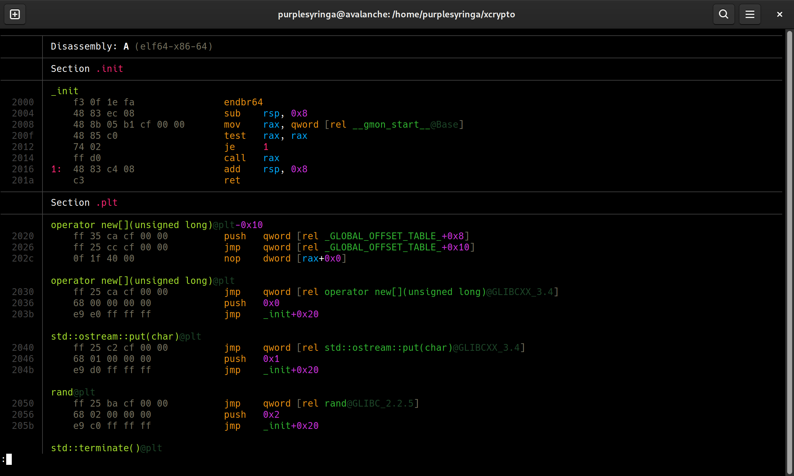

# disas

A beautiful (albeit slow) `objdump`-based disassembler for x86 and x86-64.




## Installation

You only need to copy the `disas` file form this repository -- the tool is self-contained. The simplest way to make `disas` available immediately is to run the following command:

```shell
$ wget https://raw.githubusercontent.com/purplesyringa/disas/master/disas -O ~/.local/bin/disas
$ chmod +x ~/.local/bin/disas
```


## Usage

```shell
$ disas path/to/file
```

Instead of an absolute path or a relative path, you can use the name of any executable in PATH (e.g. `bash`) or the name of any library known by ldconfig (e.g. `libcrypto.so`).

You can use `--att` to force AT&T syntax. The default is `--intel`, i.e. Intel syntax.
